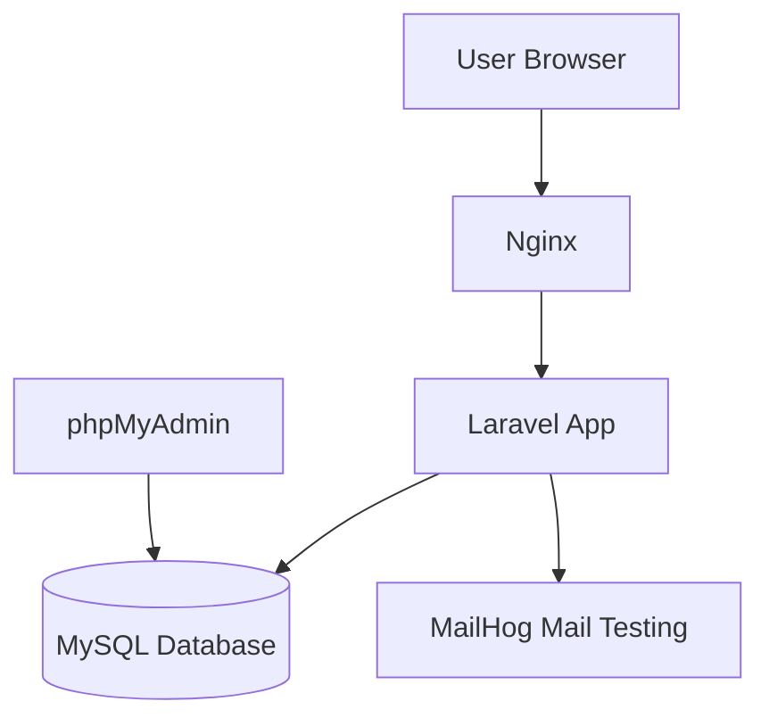

# 勤怠管理アプリ

## 概要
勤怠管理を行うWebアプリケーションです。

一般ユーザーは出勤・退勤・休憩の打刻、勤怠一覧の確認、勤怠修正申請を行うことができます。管理者は全ユーザーの勤怠情報を管理し、修正申請の承認・却下を行うことができます。

認証にはLaravel Fortifyを利用し、管理者と一般ユーザーで権限を分離しています。

## 全体構成

## 機能一覧

### 一般ユーザー
- 出勤・退勤・休憩の打刻
- 勤怠一覧・詳細確認
- 勤怠修正申請
- 申請一覧確認

### 管理者
- 全ユーザーの勤怠一覧確認（日別）
- ユーザー別月次勤怠の確認
- 勤怠詳細確認
- ユーザー一覧管理
- 申請の承認・却下

## 環境構築

### Dockerビルド

1. git clone <repository>
2. docker-compose up -d --build

### Laravel環境構築

1. docker-compose exec php bash
2. composer install
3. cp .env.example .env
4. php artisan key:generate
5. php artisan migrate
6. php artisan db:seed
7. cp .env .env.testing
   * APP_ENV=testing
   * APP_KEY=
   * DB_DATABASE=demo_test
   * DB_USERNAME=root
   * DB_PASSWORD=root
   * MAIL_MAILER=log
   * MAIL_FROM_NAME="Test"
8. docker-compose exec mysql bash
9. mysql -u root -p
10. CREATE DATABASE demo_test;
11. docker-compose exec php bash
12. php artisan key:generate --env=testing
13. php artisan config:clear
14. php artisan migrate --env=testing
15. mkdir -p tests/Unit

### テスト実行

1. php artisan config:clear
2. php artisan cache:clear
3. php artisan test

### 管理者・一般ユーザー登録

管理者は一人登録
* 管理者
  * ユーザー名	：管理者
  * email		: admin@example.com
  * password		: 12345678

一般ユーザーは3人登録
* 一人目
  * ユーザー名	：user1
  * email		: user1@example.com
  * password		: 12345678
* 二人目
  * ユーザー名	：user2
  * email		: user2@example.com
  * password	    : 12345678
* 三人目
  * ユーザー名	：user3
  * email		: user3@example.com
  * password	    : 12345678

## 開発環境

- 管理者ログイン画面:http://localhost/admin/login
- 管理者勤怠一覧画面:http://localhost/admin/attendance/list
- 一般ユーザー会員登録画面:http://localhost/register
- 一般ユーザーログイン画面:http://localhost/login
- 一般ユーザー勤怠登録画面:http://localhost/attendance
- phpMyAdmin:http://localhost:8080/
- MailHog:http://localhost:8025/

## 使用技術

- PHP 8.1.34
- Laravel 8.83.8
- Laravel Fortify
- MySQL 8.0.26
- nginx 1.21.1
- Docker

## ER図

